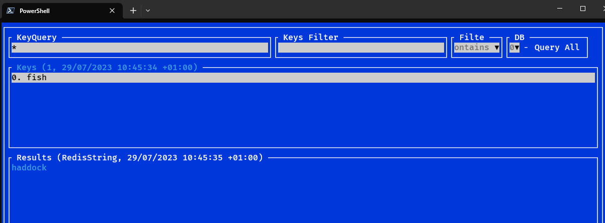

# PoshRedisViewer
A compact redis browser for powershell powered by https://github.com/StackExchange/StackExchange.Redis and https://github.com/migueldeicaza/gui.cs 

https://www.powershellgallery.com/packages/PoshRedisViewerModule


It allows you to:
1. Look for Redis Keys via Scan/Keys (depending on Redis version)
2. View the type and contents of specified key
3. Filter keys without requerying them from Redis
4. Filter results to look for useful information
5. Execute custom commands
6. Select DB index

Copy and Paste is allowed:
- Windows: Ctrl+C | Ctrl+V
- Linux: Ctrl+Y | Ctrl+V
- Keys and Results list views support copying by right-clicking on them
- In case when OS clipboard (clip/xclip) is not available, pasting from internal mini-clipboard is available with Ctrl+B combination

Query, command and filter execution require "Enter" key press.

Also, keys and commands support history mode using CursorUp and CursorDown keys.

Powershell module exports "Get-RedisViewer" command:
- [0, Mandatory] ConnectionString
- [Optional] User
- [Optional] Password

Example:
```
Install-Module -Name PoshRedisViewerModule
Import-Module -Name PoshRedisViewerModule
```
then
```
Get-RedisViewer "localhost:6379"
```
or
```
Get-RedisViewer "localhost:6379" -User me -Password myPassword
```

## Development
1. Install power shell
2. Clone the GitHub repository
3. Build the repository (if building on linux use `-r linux-x64`)
```
cd PoshRedisViewer
dotnet publish -o build -r win-x64
```
4. Copy the psd1 file into the build directory
```
cp .\PoshRedisViewerModule\PoshRedisViewerModule.psd1 .\build\
```
4. Start a new powershell instance (prevents stale modules sitting around etc)
```
pwsh
```
5. Import the module
```
Import-Module -Name ".\build\PoshRedisViewerModule.psd1"
```

## Testing With Redis Docker Image

1. Start a new Redis via docker:

```
docker run -d --name redis-stack-server -p 6379:6379 redis/redis-stack-server:latest
```

2. Connect using PoshRedisViewer

```
Get-RedisViewer "localhost:6379"
```

3. Create a Redis key entry by clicking in the 'Command' window and enter
```
set fish haddock
```

4. Query the Redis to see the key by clicking in 'KeyQuery' and pressing enter




TODO:
- Tabs/add to favorites
- Results filter history
- Quick commands to change/set values