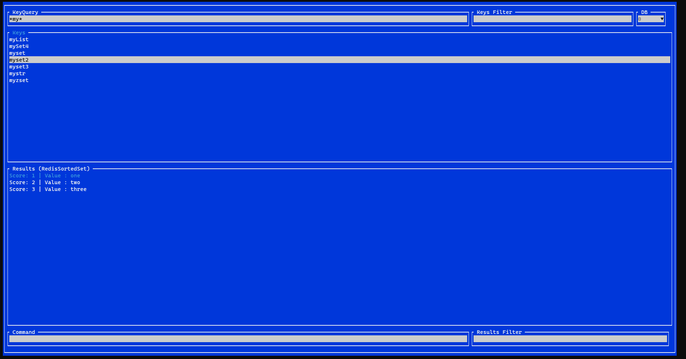

# PoshRedisViewer
A compact redis browser for powershell powered by https://github.com/StackExchange/StackExchange.Redis and https://github.com/migueldeicaza/gui.cs 

https://www.powershellgallery.com/packages/PoshRedisViewerModule



It allows you to:
1. Look for Redis Keys via Scan/Keys (depending on Redis version)
2. View the type and contents of specified key
3. Filter keys without requerying them from Redis
4. Filter results to look for useful information
5. Execute custom commands
6. Select DB index

Copy and Paste is allowed:
- Windows: Ctrl+C | Ctrl+V
- Linux: Ctrl+Y | Ctrl+V

Query, command and filter execution require "Enter" key press.

Also, keys and commands support history mode using CursorUp and CursorDown keys.

Powershell module exports "Get-RedisViewer" command:
- [0, Mandatory] ConnectionString
- [Optional] User
- [Optional] Password

Example:
```
Install-Module -Name PoshRedisViewerModule
Import-Module -Name PoshRedisViewerModule
```
then
```
Get-RedisViewer "localhost:6379"
```
or
```
Get-RedisViewer "localhost:6379" -User me -Password myPassword
```
